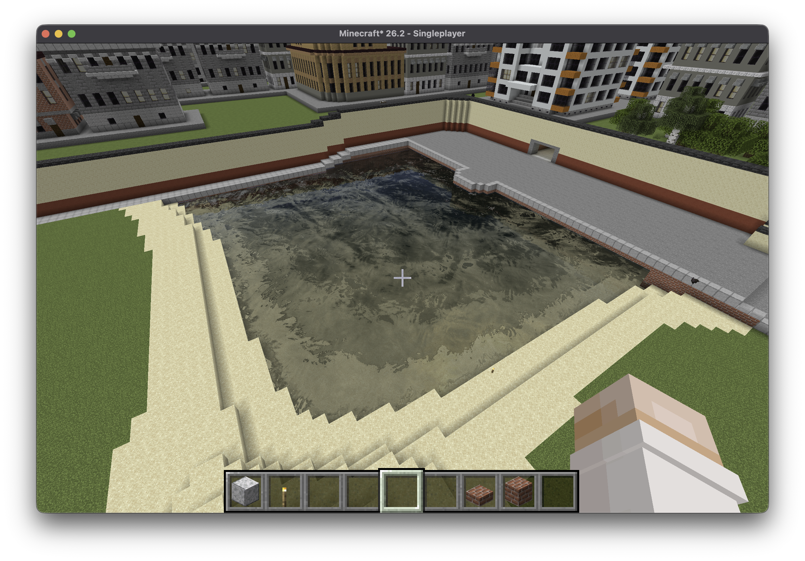
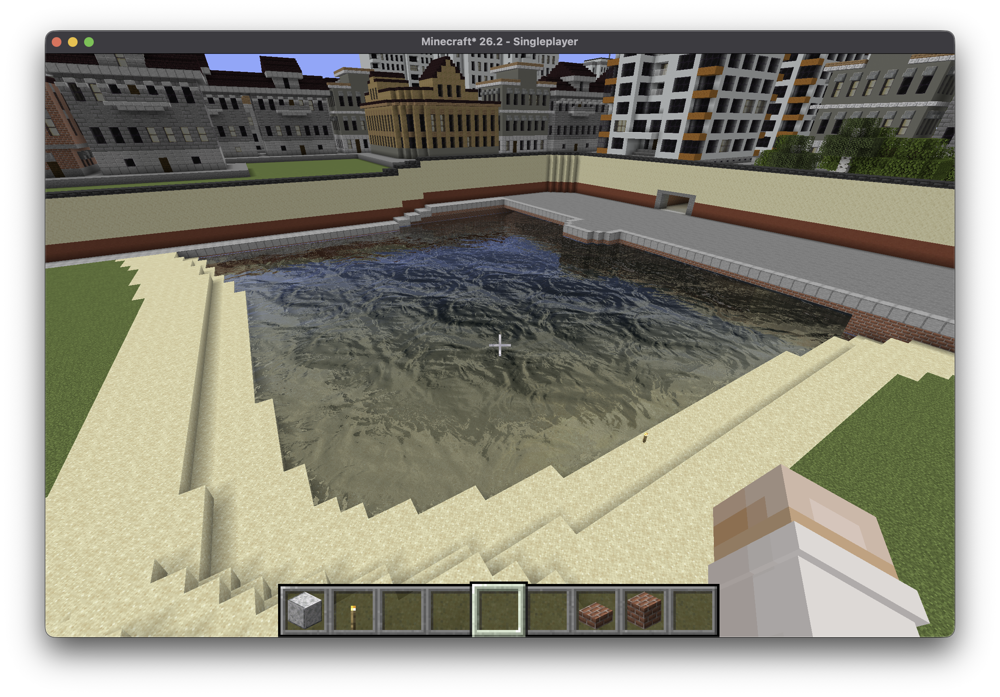
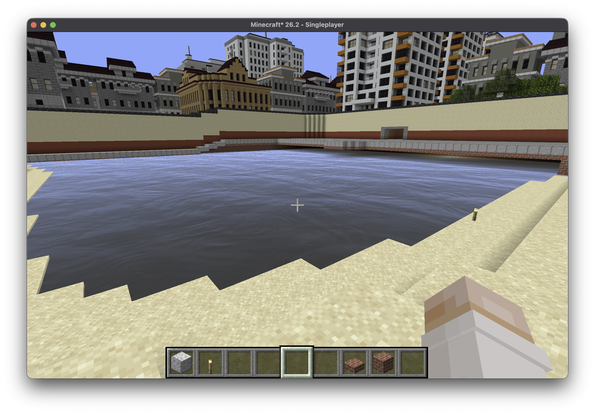

# Source Water

Source Water is a focused Minecraft shader pack for Iris that replaces vanilla water rendering with a reconstruction of water from Source Engine games. Its goal is to bring the appearance and behavior of classic Source water into Minecraft without turning the pack into a general lighting or art-style overhaul.

The implementation is based primarily on the Source 2007 renderer, with the 2004 renderer preserved as an optional classic normal-animation mode. Water materials are selected manually in the shader settings rather than inferred from Minecraft biomes, allowing the same world to use the character of a specific Source game or map.

## Recreated Source behavior

- Expensive and cheap water rendering with a distance-based LOD transition.
- Material-specific surface and underwater fog colors, fog ranges, refraction, reflection distortion, and normal-map flow.
- Fresnel-driven reflections, three-layer Source 2007 normal movement, and the original 29-frame Source 2004 animated normal map.
- Separate underwater material behavior and optional full-screen water warp.

## Minecraft adaptations

- Source planar reflection render targets are replaced with screen-space reflections for visible scene geometry and a sky fallback when SSR cannot provide a result.
- Source environment cubemaps are approximated with a light-aware Minecraft sky reflection, including the cheap-water path.
- Source-unit fog distances are converted to Minecraft blocks, while the expensive-to-cheap water transition is configured in chunks.
- Vanilla underwater tint and fog are removed so that the selected Source material controls underwater color and visibility.

## Included materials

- Half-Life 2 — Canals 03
- Half-Life 2 — Canals Clear
- Half-Life 2: Lost Coast — ATI
- Half-Life 2: Episode One — Riverbed 01
- Half-Life 2: Episode Two — Riverbed 01
- Half-Life 2: Episode Two — Riverbed 02
- Half-Life 2: Episode Two — Silo
- Half-Life 2: Episode Two — Tunnels
- Counter-Strike: Source — Militia

Pairs especially well with [Squake](https://modrinth.com/mod/squake-fabric-updated).





## Installation

1. Download `Source-Water-<version>.zip` from GitHub Actions or Releases.
2. Place the ZIP in Minecraft's `shaderpacks` directory without extracting it.
3. Select **Source Water** in Iris.

Water appearance is selected manually through shader options. It is not inferred from Minecraft biomes.

## Development

Validate all shader variants and build the distributable ZIP:

```sh
./scripts/check.sh
./scripts/build.sh
```

## References and attribution

The implementation is based on reverse engineering and study of the [Source SDK 2004](https://github.com/Source-SDK-Base-Legacy-Project/source-sdk-2004) and [Source SDK 2007](https://github.com/Source-SDK-Base-Legacy-Project/source-sdk-2007).

Developed with assistance from **ChatGPT 5.6 Sol**.

This is an independent, unofficial fan project. It is not affiliated with or endorsed by Valve, Mojang, Microsoft or Iris.

Original project code and documentation are available under the [WTFPL](LICENSE). Source-derived assets and inherited shader components are not relicensed; see [COPYRIGHT](COPYRIGHT) and [THIRD_PARTY_NOTICES.md](THIRD_PARTY_NOTICES.md).
